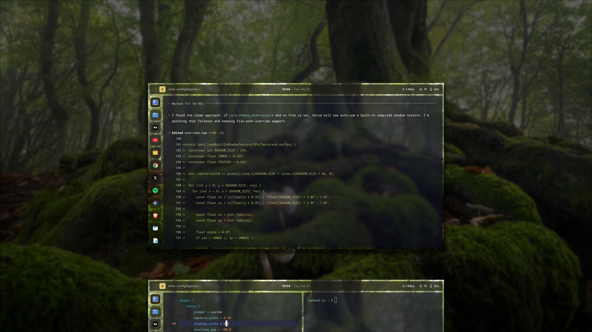

# Horza

Vibecoded project disclaimer: Horza is built fast and iteratively; expect rapid changes and occasional rough edges between releases.



## What It Is

Horza is a workspace overview plugin for Hyprland.

What you get:
- a fast workspace overview with live/cached workspace cards
- smooth workspace transit (`horza:workspace`)
- drag-and-drop window moves between workspace cards
- configurable background blur/tint, titles, and card styling

Goal:
- GNOME-like overview feel, but lightweight

## Animation Tuning

Horza follows your Hyprland animation config.

If you want it snappier or smoother, tune your Hyprland animation block (especially `windowsMove` speed/curve).

## Performance Notes

- rapid card switching prefers cached previews briefly instead of forcing an immediate recapture on every step
- monitor damage refresh targets the actually dirty workspace card, not blindly the currently selected card
- `prewarm_all = true` still means capture all cards on open; `frame_pump*` settings only affect how actively Horza keeps driving frames while work or animation is in flight

## Install

### Via hyprpm (recommended)

```bash
hyprpm update
hyprpm add https://github.com/mehmedthe2nd/horza
hyprpm enable horza
```

Update later:

```bash
hyprpm update
```

Note:
- If you use `hyprpm`, do not also keep a manual `plugin = .../libhorza.so` line for the same plugin in your config.

### Manual build

Build:
```bash
cmake -S . -B build -DCMAKE_INSTALL_PREFIX="$HOME/.local"
cmake --build build -j"$(nproc)"
```

Install:
```bash
cd build
make install
```

Default install path with this setup:
- `$HOME/.local/lib/libhorza.so`

Load plugin:
```bash
hyprctl plugin load "$HOME/.local/lib/libhorza.so"
```

Reload plugin after rebuild:
```bash
hyprctl plugin unload "$HOME/.local/lib/libhorza.so"
hyprctl plugin load "$HOME/.local/lib/libhorza.so"
```

## Before You Build

Horza is a Hyprland plugin, so version matching matters.

Compatibility rule:
- build Horza against the same Hyprland build you are currently running
- whenever Hyprland updates, rebuild Horza

If this is not matched, Hyprland will reject the plugin at load time.

Requirements:
- `cmake` 3.19+
- `pkg-config`
- C++ compiler with C++23 support
- Hyprland development package (`hyprland.pc`)
- `pixman-1` development package
- `libdrm` development package

Quick check:
```bash
pkg-config --modversion hyprland pixman-1 libdrm
```

If this command fails for any package, install that package's development headers first.

## Config

Put options in your `hyprland.conf` inside `plugin { horza { ... } }`.

Default config (all options):
```ini
plugin {
  horza {
    capture_scale = 1.0                  # Capture resolution scale (0.05..1.0)
    display_scale = 0.60                 # Card scale in overview
    overview_gap = 20.0                  # Gap between cards (logical px)
    inactive_tile_size_percent = 85.0    # Size of off-center cards (% of active)

    persistent_cache = true              # Reuse saved tile textures between opens
    cache_ttl_ms = 5000.0                # Tile cache max age (ms)
    cache_max_entries = 96               # Tile cache entry cap
    capture_budget_ms = 4.0              # Per-frame capture budget (ms)
    max_captures_per_frame = 1           # Max optional captures each frame
    live_preview_fps = 60.0              # Refresh rate for visible non-current cards
    live_preview_radius = 1              # How many neighbor cards can live-refresh
    prewarm_all = true                   # Capture all cards on open if true
    frame_pump = true                    # Keep issuing frames while overview motion/work is active
    frame_pump_aggressive = true         # Also pump from render pass (yalsen-like, smoother, higher cost)
    frame_pump_fps = 0.0                 # Pump FPS cap; 0 = auto (monitor refresh rate)

    background_source = hyprpaper        # hyprpaper | black
    background_blur_radius = 3.0         # Background blur radius
    background_blur_passes = 1           # Background blur passes
    background_blur_spread = 1.0         # Background blur spread
    background_blur_strength = 1.0       # Background blur strength
    background_tint = 0.35               # Black tint alpha over background (0..1)

    card_shadow = true                   # Enable card shadow
    card_shadow_mode = fast              # fast | texture
    card_shadow_texture = ""             # PNG path (used when mode=texture)
    card_shadow_alpha = 0.2              # Shadow alpha (0..1)
    card_shadow_size = 5.0               # Shadow size/spread (logical px)
    card_shadow_offset_y = 2.0           # Shadow Y offset (logical px)

    show_window_titles = true            # Show title pill below each card
    title_font_size = 14                 # Title font size (pt)
    title_font_family = "Inter Regular"  # Title font family name
    title_background_alpha = 0.35        # Title pill alpha (0..1)

    freeze_animations_in_overview = true # Freeze workspace/window anim vars while open
    esc_only = true                      # If true, only Esc closes from keyboard
    drag_hover_jump_delay_ms = 1000.0    # Delay before hover-drag triggers index jump

    vertical = false                     # Layout axis: false=horizontal, true=vertical
    center_offset = 0.0                  # Cross-axis offset (logical px)
    corner_radius = 0                    # Card corner radius (logical px)
  }
}
```

Use `true` or `false` for all boolean options.
